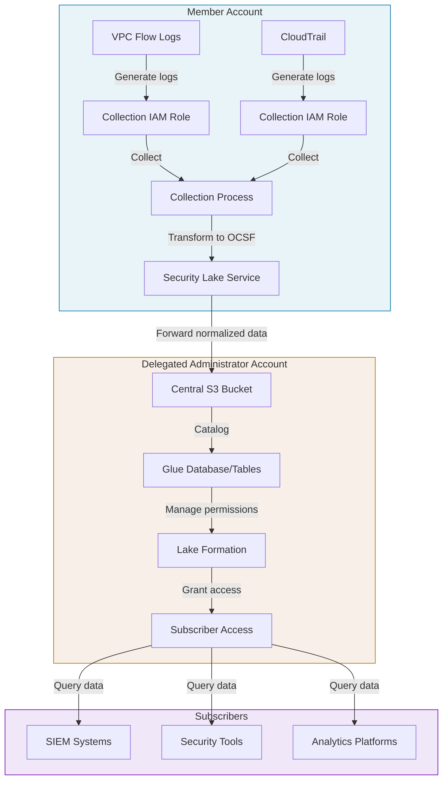
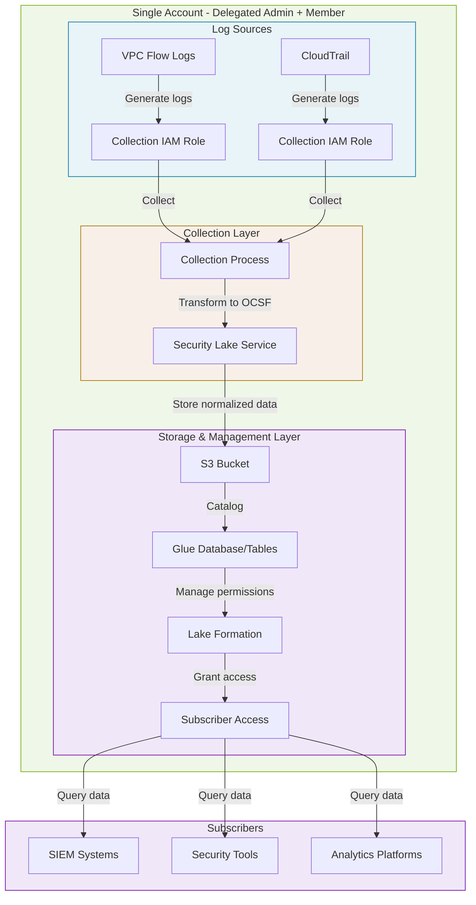
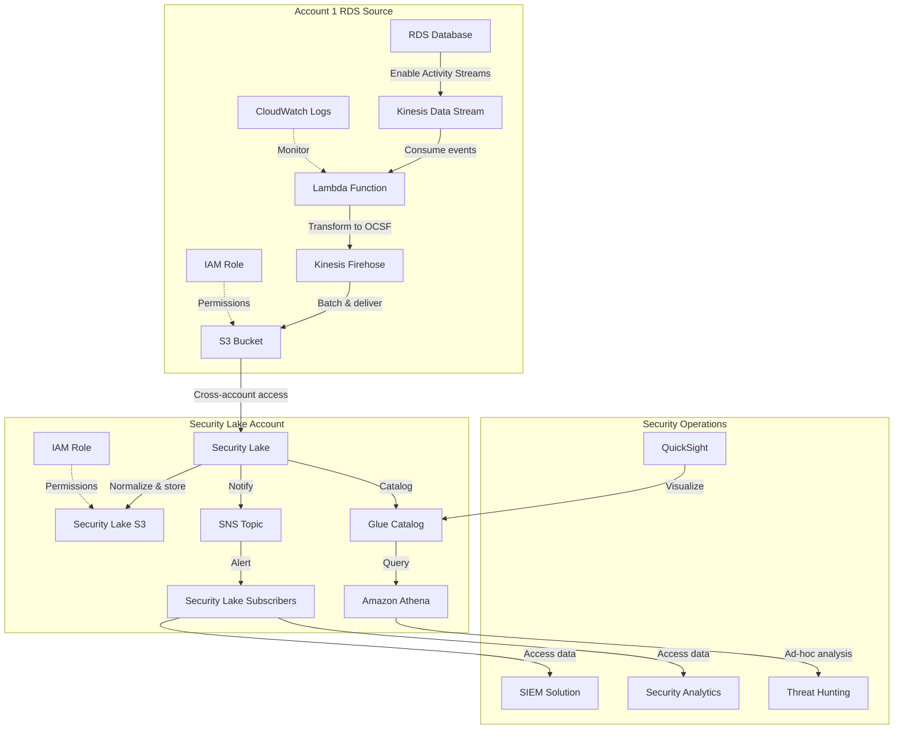
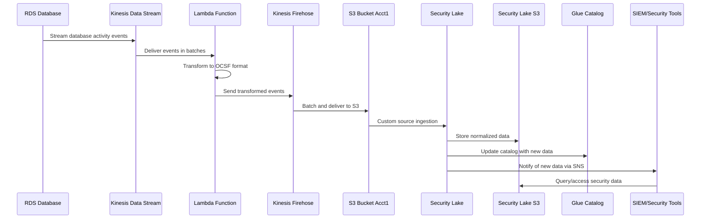

# AWS Security Lake: Enabling and Disabling Impact

## Impacts of Enabling AWS Security Lake

### Positive Impacts
- **Centralized Security Data**: Consolidates security logs and events from various AWS services, third-party sources, and custom sources
- **Standardized Format**: Converts data to the Open Cybersecurity Schema Framework (OCSF) format
- **Enhanced Analysis**: Enables more comprehensive threat detection and investigation
- **Organization-wide Visibility**: Provides security visibility across multiple AWS accounts
- **Tool Integration**: Facilitates integration with security analysis tools and SIEM systems

### Operational Impacts
- **Storage Costs**: Incurs costs for storing security data in S3 buckets
- **Data Transfer Costs**: May incur costs for data movement between regions or to subscribers
- **Resource Creation**: Creates resources like S3 buckets, Glue databases, and Lake Formation permissions
- **IAM Requirements**: Requires specific IAM roles and permissions

## Resources Created When Enabling Security Lake

When Security Lake is enabled in an organization, AWS automatically creates and manages several resources:

### IAM Roles and Permissions
- **AmazonSecurityLakeServiceRolePolicy**: Service-linked role for Security Lake operations
- **Security Lake Collection Role**: IAM role for collecting logs from AWS services
- **Security Lake Access Role**: IAM role for subscribers to access data
- **Lake Formation Permissions**: Permissions to manage data lake resources

### AWS Resources
- **S3 Buckets**: 
  - Data lake bucket for storing normalized security data
  - Access logs bucket for S3 access logging
- **Glue Resources**:
  - Glue Database for Security Lake
  - Glue Tables for each data source type
  - Glue Crawlers to catalog data
- **Lake Formation**:
  - Data lake settings and permissions
  - Resource links and data locations
- **CloudWatch Logs**:
  - Log groups for Security Lake operations
- **KMS Keys** (if encryption enabled):
  - Customer managed keys for data encryption

### Networking
- **VPC Endpoints** (if configured):
  - Interface endpoints for private connectivity

### Resource Distribution in AWS Organizations

Resources are distributed across accounts as follows:

- **Delegated Administrator Account**:
  - Primary S3 buckets for centralized data storage
  - Glue databases and tables for the entire organization
  - Lake Formation permissions and settings
  - Subscriber access management resources
  - Service-linked roles for administration
  - CloudWatch log groups for centralized monitoring

- **Member/Participating Accounts**:
  - Service-linked roles for log collection
  - Collection IAM roles specific to each account
  - Local CloudWatch log groups for collection activities
  - Data collection processes and configurations

The delegated administrator account hosts most of the centralized infrastructure, while member accounts contain only the necessary resources for collecting and forwarding logs to the central repository.

## Security Lake Collection Process

### How Security Lake Collects Data
AWS Security Lake uses built-in collection mechanisms that:
- Collect log data from enabled AWS sources within an account
- Transform collected data into the Open Cybersecurity Schema Framework (OCSF) format
- Handle the extraction, transformation, and loading (ETL) processes
- Manage the secure transfer of normalized data to the central S3 bucket

> **Official Documentation**: According to the [AWS Security Lake User Guide](https://docs.aws.amazon.com/security-lake/latest/userguide/data-collection.html): "When you add a source to Security Lake, Security Lake automatically begins collecting logs and events from that source. Security Lake converts the collected data to the OCSF format and stores it in your Amazon S3 bucket."

### Deployment and Management
- **Who Deploys**: AWS automatically deploys and manages the Security Lake Collection Process
- **How It's Deployed**: 
  - Deployed automatically when Security Lake is enabled and sources are configured
  - No manual installation or configuration required by customers
  - Provisioned in each member account that has Security Lake enabled
  - Operates as a service-linked component with appropriate IAM permissions

### Maintenance and Updates
- **Fully AWS-Managed**: AWS handles all maintenance, updates, and scaling
- **No Customer Overhead**: Customers don't need to patch, update, or monitor the collection process
- **Automatic Scaling**: Scales automatically based on log volume
- **Resilience**: Built with redundancy to ensure reliable log collection

### Configuration
- Customers only need to:
  - Enable desired log sources through the Security Lake console or API
  - Configure which regions to collect from
  - Set up appropriate IAM permissions
  - No direct agent configuration is required

## Impacts of Disabling AWS Security Lake

- **Data Retention**: Existing collected data remains in S3 buckets until manually deleted
- **Historical Data Access**: You can still access historical data but no new data will be collected
- **Subscriber Impact**: Subscribers will no longer receive new security data
- **Resource Persistence**: AWS resources created by Security Lake remain until manually removed
- **Cost Implications**: Stops incurring costs for new data ingestion, but storage costs continue for existing data

## Can Customers Disable Security Lake Without Issues?

Yes, customers can disable AWS Security Lake at any time, but should be aware of these considerations:

1. **Resource Cleanup**: Disabling Security Lake does not automatically delete created resources (S3 buckets, Glue tables, etc.). These must be manually removed to avoid ongoing storage costs.

2. **Data Access**: After disabling, you'll still have access to previously collected data, but no new data will be ingested.

3. **Subscriber Notification**: It's important to notify any subscribers that they will no longer receive new security data.

4. **Re-enabling Process**: If you decide to re-enable Security Lake later, you'll need to reconfigure your settings and data sources.

5. **Billing Transition**: While new ingestion costs will stop immediately, you'll continue to be billed for stored data and any remaining resources.

There are no technical blockers to disabling Security Lake, but proper planning for resource management and communication with stakeholders is recommended to ensure a smooth transition.

## Organizational Best Practices

- **Regular Review**: Periodically review Security Lake usage and costs
- **Data Lifecycle Policies**: Implement lifecycle policies for security data to manage storage costs
- **Documentation**: Maintain documentation of Security Lake configuration for future reference
- **Testing**: Consider testing the disable/re-enable process in a non-production environment first

## Security Lake Data Flow Scenarios

### Scenario 1: Separate Delegated Administrator and Member Account



### Scenario 2: Single Account as Both Delegated Administrator and Member



In Scenario 1, the member account collects and transforms data before forwarding it to the delegated administrator account for centralized storage and management. The delegated administrator maintains the central infrastructure and controls subscriber access.

In Scenario 2, all components exist within a single account that serves as both the delegated administrator and member. The data flow is more direct since collection, transformation, storage, and access management all occur within the same account.

# Detailed Architecture: RDS Data Streams to AWS Security Lake

## Component Diagram



## Data Flow Sequence



## Technical Implementation Details

### RDS Database Activity Streams Configuration

```json
{
  "AWS::RDS::DBInstance": {
    "Properties": {
      "EnableActivityStream": true,
      "ActivityStreamKinesisStreamName": "rds-activity-stream",
      "ActivityStreamMode": "async",
      "ActivityStreamEngineNativeAuditFieldsIncluded": true
    }
  }
}
```

### Lambda Function for OCSF Transformation

```python
import json
import base64
import boto3
from datetime import datetime

def lambda_handler(event, context):
    firehose = boto3.client('firehose')
    
    output_records = []
    for record in event['Records']:
        # Decode and parse the RDS activity stream record
        payload = json.loads(base64.b64decode(record['kinesis']['data']))
        
        # Transform to OCSF format
        ocsf_event = {
            "metadata": {
                "version": "1.0.0-rc.2",
                "class_name": "database_activity",
                "class_uid": 3002,
                "timestamp": datetime.utcnow().isoformat() + "Z"
            },
            "database": {
                "name": payload.get('databaseName', ''),
                "schema": payload.get('schema', ''),
                "operation": payload.get('command', ''),
                "user": payload.get('dbUserName', '')
            },
            "src": {
                "ip": payload.get('sourceIpAddress', ''),
                "port": payload.get('sourcePort', 0)
            },
            "dst": {
                "ip": payload.get('databaseHost', ''),
                "port": payload.get('databasePort', 0)
            },
            "resources": [{
                "type": "Database",
                "name": payload.get('databaseName', ''),
                "uid": payload.get('dbInstanceId', '')
            }],
            "cloud": {
                "provider": "AWS",
                "account": {
                    "uid": context.invoked_function_arn.split(":")[4]
                },
                "region": context.invoked_function_arn.split(":")[3]
            }
        }
        
        # Add to output batch
        output_records.append({
            'Data': json.dumps(ocsf_event) + '\n'
        })
    
    # Send to Firehose
    firehose.put_record_batch(
        DeliveryStreamName='rds-activity-to-s3',
        Records=output_records
    )
    
    return {
        'statusCode': 200,
        'body': f'Processed {len(output_records)} records'
    }
```

### Security Lake Custom Source Configuration

```json
{
  "source": {
    "sourceArn": "arn:aws:s3:::account1-rds-activity-logs",
    "sourceName": "rds-activity-streams",
    "sourceVersion": "1.0",
    "dataFormat": "OCSF",
    "ocsf": {
      "class": "database_activity",
      "version": "1.0.0-rc.2"
    },
    "s3SourceConfig": {
      "bucketArn": "arn:aws:s3:::account1-rds-activity-logs",
      "prefix": "rds-activity/",
      "roleArn": "arn:aws:iam::security-account-id:role/SecurityLakeRDSIngestionRole"
    }
  }
}
```

### Cross-Account IAM Policy

```json
{
  "Version": "2012-10-17",
  "Statement": [
    {
      "Effect": "Allow",
      "Principal": {
        "AWS": "arn:aws:iam::security-account-id:role/SecurityLakeRDSIngestionRole"
      },
      "Action": [
        "s3:GetObject",
        "s3:ListBucket"
      ],
      "Resource": [
        "arn:aws:s3:::account1-rds-activity-logs",
        "arn:aws:s3:::account1-rds-activity-logs/*"
      ]
    }
  ]
}
```

## Monitoring and Operations

**CloudWatch Metrics to Monitor:**
* Lambda invocation and error rates
* Kinesis Data Stream throttling events
* Firehose delivery success rate
* Security Lake ingestion metrics

**Operational Considerations:**
* Set appropriate retention periods in Security Lake
* Configure alerts for ingestion failures
* Implement data quality checks
* Regularly validate OCSF schema compliance
