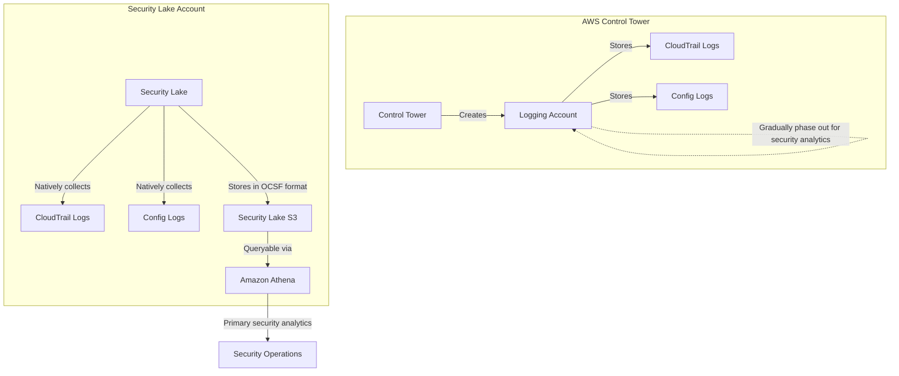
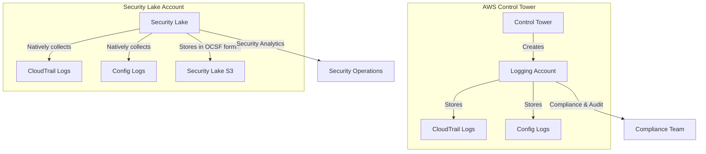
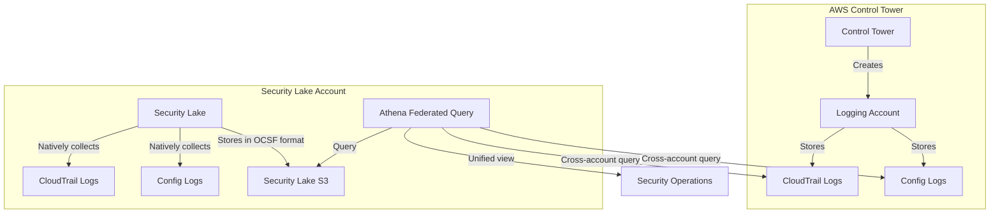
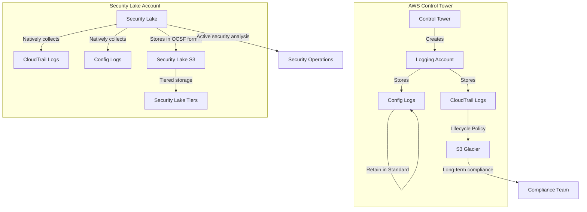

# AWS Control Tower and Security Lake Integration Strategies

## Overview

When using AWS Control Tower with a centralized logging account alongside AWS Security Lake, organizations need a clear strategy for managing CloudTrail and AWS Config logs. This document outlines approaches to integrate these services effectively.

## Integration Architectures

### Option 1: Security Lake as Primary Security Data Lake



### Option 2: Dual-Purpose Architecture



### Option 3: Unified View with Cross-Account Access



### Option 4: S3 Lifecycle Management for CloudTrail Logs



## Recommended Strategy

1. **Enable native AWS Security Lake sources** for CloudTrail and Config in all accounts
   - Security Lake will automatically collect these logs in OCSF format
   - This provides standardized data for security analytics

2. **Maintain Control Tower logging account** for compliance and governance
   - Keep existing CloudTrail and Config logs in the logging account
   - These serve as the compliance system of record

3. **Implement S3 lifecycle policies for CloudTrail logs** for cost optimization:
   - **Hot tier (0-30 days)**: Keep CloudTrail logs in S3 Standard for active investigations
   - **Warm tier (31-90 days)**: Move CloudTrail logs to S3 Infrequent Access
   - **Cold tier (91+ days)**: Move CloudTrail logs to S3 Glacier for compliance retention
   - **Keep Config logs in S3 Standard**: Maintain Config logs in standard storage for ongoing compliance monitoring
   - **Example CloudTrail lifecycle rule**:
     ```json
     {
       "Rules": [
         {
           "Status": "Enabled",
           "Prefix": "AWSLogs/CloudTrail/",
           "Transitions": [
             {
               "Days": 30,
               "StorageClass": "STANDARD_IA"
             },
             {
               "Days": 90,
               "StorageClass": "GLACIER"
             }
           ],
           "Expiration": {
             "Days": 2555  // 7 years for compliance
           }
         }
       ]
     }
     ```

4. **Define clear use cases for each repository**:
   - **Control Tower Logging Account**: Compliance, audit, governance, long-term retention
   - **Security Lake**: Security monitoring, threat detection, investigation, active security analytics

5. **Consider data retention strategies**:
   - Security Lake: Configure appropriate retention based on security needs (typically 1-3 months)
   - CloudTrail logs: Implement longer retention via S3 lifecycle policies for compliance
   - Config logs: Maintain in S3 Standard for continuous access to configuration history

6. **Implement cross-account query capability**:
   - Use Athena Federated Query to create a unified view when needed
   - Create views that join data from both sources for specific use cases

## Benefits of This Approach

1. **Cost optimization**: Use S3 lifecycle policies to reduce storage costs for older logs
2. **Compliance**: Maintain long-term storage for compliance requirements
3. **Security focus**: Leverage Security Lake's OCSF format and security-focused capabilities
4. **Operational efficiency**: Clear separation of responsibilities between compliance and security teams
5. **Standardization**: OCSF format in Security Lake enables better integration with security tools

## Implementation Considerations

1. **Avoid duplication**: Configure Security Lake to collect CloudTrail from all accounts except the logging account
2. **Query optimization**: Create partitioned tables in Athena for better query performance
3. **Access control**: Implement proper IAM and Lake Formation permissions
4. **Monitoring**: Set up CloudWatch metrics to track S3 storage costs and lifecycle transitions
5. **Data sovereignty**: Configure Security Lake regions to match compliance requirements
