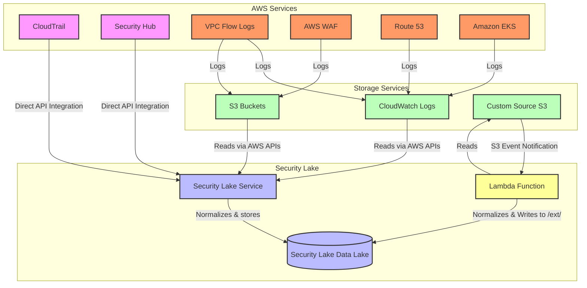
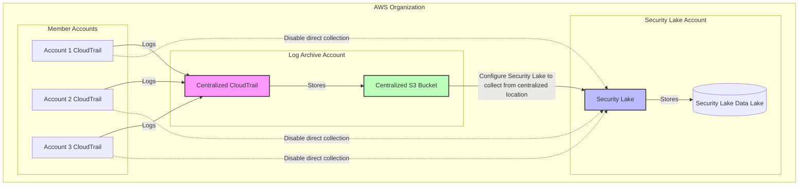
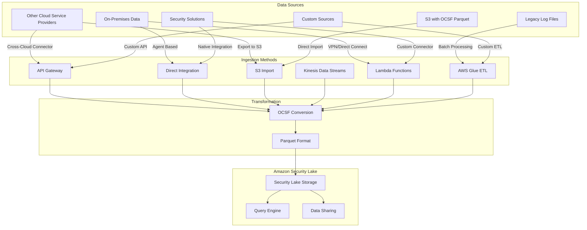

### Scenario 1: Centralized CloudTrail with Security Lake

### Scenario 2: Distributed CloudTrail with Security Lake

## VPC Flow Logs Integration with Security Lake

### Scenario 2: Distributed VPC Flow Logs with Security Lake

### CloudTrail Filtering and Security Lake Collection

### VPC Flow Logs Filtering and Security Lake Collection

